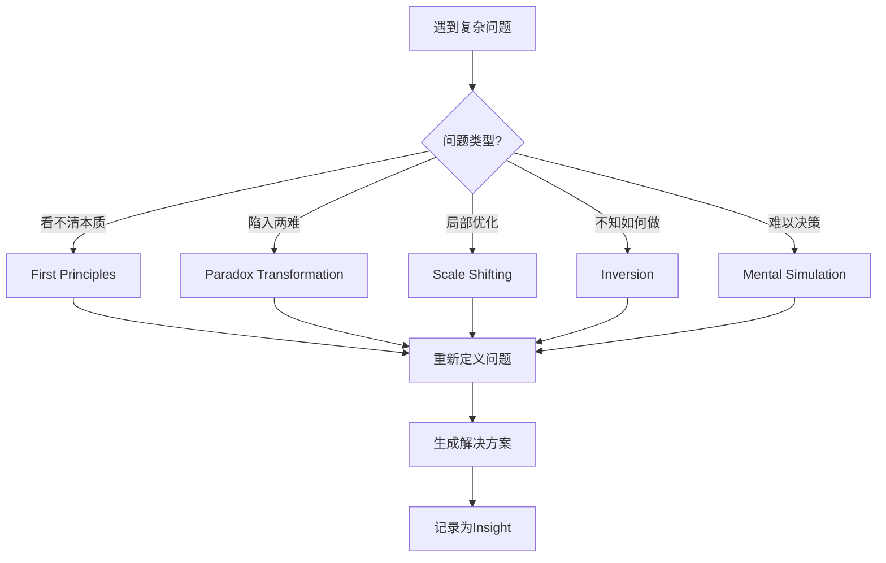

---
# === 核心属性 ===
type: tools
mode: deep  # Tools 仅支持 deep mode (思维工具需要深度思考)
status: active
created: <%tp.date.now("YYYY-MM-DD HH:mm")%>
updated: <%tp.date.now("YYYY-MM-DD HH:mm")%>
tags: [neuromancer/tools, thinking]

# === 扩展属性 ===
category: mental_models  # mental_models | frameworks | techniques
---

> [!abstract] Thinking Tools: 思维工具箱
> **用途**: 高级思维框架和认知工具集合  
> **场景**: 面对复杂问题、需要突破思维定式时使用

---

## 🧰 工具概览

**当前收录工具**: 5个核心思维框架  
**使用频率**: 按需调用，无固定频率  
**学习曲线**: 中-高（需要实践才能熟练）

---

## 🔍 核心思维工具

### 1. Scale Shifting (尺度切换) ⭐⭐⭐

> [!tip] 何时使用
> - 问题看起来无解时
> - 陷入局部优化时
> - 需要全局视角时

#### 概念
**在不同时空尺度上重新审视问题**

**时间尺度**:
- ⚡ 此刻 (1分钟视角)
- 📅 今日 (24小时视角)
- 📆 本月 (30天视角)
- 📊 本年 (365天视角)
- 🎯 5年 (长期视角)
- 🌟 一生 (终极视角)

**空间尺度**:
- 🔬 微观 (细节/个体)
- 👤 个人 (自我视角)
- 👥 关系 (人际网络)
- 🏢 组织 (团队/公司)
- 🌍 全局 (行业/社会)
- 🌌 宇宙 (终极意义)

#### 应用框架

**当前问题**: <%tp.file.cursor(1)%>

**尺度切换分析**:

| 尺度 | 这个问题是什么？ | 重要性如何？ | 如何应对？ |
|------|----------------|-------------|-----------|
| **此刻** | | | |
| **今日** | | | |
| **本月** | | | |
| **本年** | | | |
| **5年后** | | | |
| **一生** | | | |

**洞察**: 切换到[[  ]]尺度后，发现...

---

### 2. Paradox Transformation (悖论转化) ⭐⭐⭐

> [!tip] 何时使用
> - 面对二选一困境时
> - 感觉两难时
> - 需要创造性解决方案时

#### 概念
**将"非此即彼"转化为"既此又彼"**

#### 常见悖论类型

**A. 时间悖论**:
- 短期收益 vs 长期投资
- 当下享乐 vs 未来积累

**B. 资源悖论**:
- 专注深耕 vs 广泛涉猎
- 质量完美 vs 快速迭代

**C. 关系悖论**:
- 独立自主 vs 深度链接
- 坦诚直接 vs 照顾感受

#### 应用框架

**当前悖论**: [[<%tp.file.cursor(2)%>]]

**Step 1: 识别两极**
- **A极**: (如：专注深耕)
- **B极**: (如：广泛涉猎)

**Step 2: 理解张力**
- **为什么A很重要**: 
- **为什么B也很重要**: 
- **为什么难以兼得**: 

**Step 3: 寻找第三条路**

**策略1 - 时间分离**:
> 不同时间段做不同的事
> 示例: 工作日专注，周末探索

**策略2 - 层次分离**:
> 在不同层次同时满足
> 示例: 核心专注，边缘多元

**策略3 - 重新定义**:
> 改变问题框架
> 示例: 专注于"学习能力"而非具体领域

**策略4 - 动态平衡**:
> 根据情境灵活切换
> 示例: 根据能量/机会动态调整

**我的解决方案**: 
> 

---

### 3. First Principles (第一性原理) ⭐⭐⭐

> [!tip] 何时使用
> - 质疑既有做法时
> - 需要创新突破时
> - 想要深入本质时

#### 概念
**回到问题的根本，从基本事实重新推导**

#### 应用框架

**当前问题/做法**: 

**Step 1: 拆解假设**
列出当前做法背后的所有假设:
1. 
2. 
3. 

**Step 2: 验证假设**
哪些假设是真正的物理定律/人性本质？
哪些只是历史遗留/惯性思维？

| 假设 | 真理 or 惯性? | 依据 |
|------|--------------|------|
| | | |

**Step 3: 重新构建**
基于真正的基本事实，如何重新设计？
> 

**洞察**: 

---

### 4. Inversion (逆向思维) ⭐⭐

> [!tip] 何时使用
> - 正向思考陷入僵局时
> - 需要避免失败时
> - 想要看清隐藏风险时

#### 概念
**不问"如何成功"，而问"如何失败"**

#### 应用框架

**目标**: [[<%tp.file.cursor(3)%>]]

**正向问题**: 如何实现这个目标？
**逆向问题**: 如何确保失败？

**失败清单** (如果我想搞砸，我会...):
1. 
2. 
3. 
4. 
5. 

**避免策略** (如何避免这些失败):
| 失败方式 | 预防措施 | 检测指标 |
|---------|---------|---------|
| | | |

**洞察**: 从逆向思考中学到...

---

### 5. Mental Simulation (心智模拟) ⭐⭐

> [!tip] 何时使用
> - 做重大决策前
> - 需要预演未来时
> - 想要情景规划时

#### 概念
**在脑中预演未来场景，体验可能的结果**

#### 应用框架

**决策点**: 

**情景A: 选择X**
**6个月后**:
- 最可能发生: 
- 最好情况: 
- 最坏情况: 
- 我的感受: 

**情景B: 选择Y**
**6个月后**:
- 最可能发生: 
- 最好情况: 
- 最坏情况: 
- 我的感受: 

**情景C: 不选择/第三条路**
**6个月后**:
- 最可能发生: 
- 最好情况: 
- 最坏情况: 
- 我的感受: 

**模拟后的决策**: 
> 

---

## 🔄 工具组合使用

### 复杂问题解决流程



### 工具组合示例

**情景**: 职业发展困惑

1. **Scale Shifting**: 从一生尺度看，这份工作的意义？
2. **First Principles**: 什么是好工作的本质？金钱？成长？意义？
3. **Paradox**: 稳定 vs 冒险，如何兼得？
4. **Inversion**: 如何确保职业生涯失败？
5. **Simulation**: 不同选择的6个月后场景

---

## 📚 工具学习路径

### 新手阶段 (第1-2周)
**目标**: 理解概念
- [ ] 阅读每个工具的说明
- [ ] 选择1-2个最感兴趣的
- [ ] 用简单问题练习

### 熟练阶段 (第3-8周)
**目标**: 形成习惯
- [ ] 每周至少用1次思维工具
- [ ] 记录使用效果
- [ ] 调整个人化版本

### 精通阶段 (3个月+)
**目标**: 自然调用
- [ ] 遇到问题自动识别适用工具
- [ ] 工具组合使用
- [ ] 创造自己的工具

---

## 📊 使用记录

### 本月使用统计

```dataview
TABLE 
  tool as "工具",
  problem as "应用问题",
  insight as "核心洞察"
FROM "02-Knowledge/Insight"
WHERE contains(tags, "thinking-tools")
  AND created >= date(this.file.cday) - dur(30 days)
SORT created DESC
LIMIT 10
```

### 最有效的工具

**个人Top 3**:
1. [[  ]] - 使用次数: X次，效果: ⭐⭐⭐⭐⭐
2. [[  ]] - 使用次数: X次，效果: ⭐⭐⭐⭐
3. [[  ]] - 使用次数: X次，效果: ⭐⭐⭐

---

## 🔗 相关资源

**核心洞察**:
- [[Insight/]] - 使用工具产生的洞察

**决策记录**:
- [[Decision/]] - 工具辅助的决策

**复盘学习**:
- [[Loop/]] - 工具使用效果复盘

**扩展阅读**:
- 查理·芒格：《穷查理宝典》- 多元思维模型
- 理查德·费曼：第一性原理思维
- 《超级思维》：118个思维模型

---

## 💡 工具进化

### 待添加工具
- [ ] 二阶思维 (Second-Order Thinking)
- [ ] 奥卡姆剃刀 (Occam's Razor)
- [ ] 机会成本 (Opportunity Cost)
- [ ] 复利思维 (Compounding)
- [ ] 概率思维 (Probabilistic Thinking)

### 个人创造工具
**工具名**: <%tp.file.cursor(4)%>
**适用场景**: 
**操作步骤**: 
1. 
2. 
3. 

---

## ⚡ 快速参考卡

| 问题特征 | 推荐工具 | 核心问题 |
|---------|---------|---------|
| 看起来无解 | Scale Shifting | 换个尺度看呢？ |
| 二选一困境 | Paradox | 如何两者兼得？ |
| 质疑现状 | First Principles | 真正的基本事实是什么？ |
| 不知如何做 | Inversion | 如何确保失败？ |
| 难以决策 | Simulation | 6个月后会怎样？ |

---

**维护频率**: 发现新工具时添加，每月回顾使用效果  
**成熟标志**: 遇到问题自动调用合适工具  
**终极目标**: 内化为思维习惯，无需刻意调用
