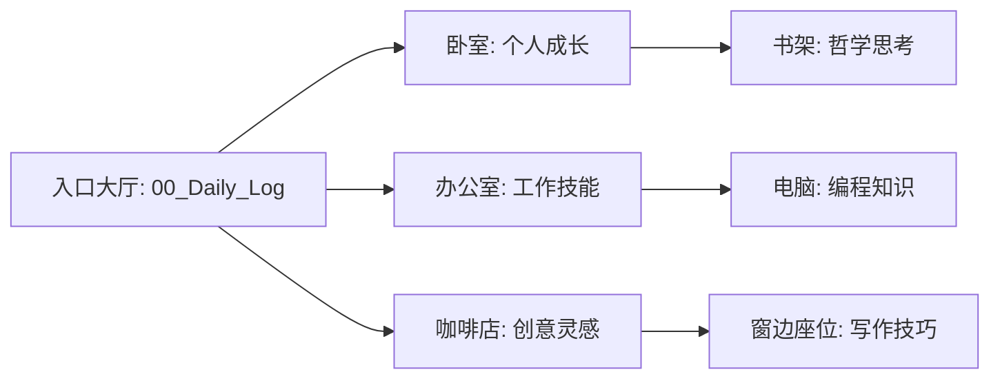

> [!NOTE] 核心原则
> **目的**: 构建你的个人记忆宫殿，将抽象知识锚定到熟悉的物理空间
> **触发**: 新建重要System或需要深度记忆的知识领域时
> **规则**: 每个空间只承载一个核心主题，避免混乱

> [!TIP] 最强大脑记忆宫殿法
> 记忆宫殿法(Method of Loci)利用人类大脑卓越的空间记忆能力。研究表明，通过这种方法训练，普通人的记忆能力可提升2-3倍，长期留存率从30%提升至80%以上。

---

## 🏛️ 第一步：构建你的记忆宫殿

### 1.1 熟悉空间盘点
*列出你最熟悉的物理空间(至少3个)*

| 空间名称 | 熟悉程度 | 可用锚点数 | 已分配主题 |
|---------|---------|----------|----------|
| 我的卧室 | ⭐⭐⭐⭐⭐ | 10 | [[07_System/个人成长]] |
| 办公室 | ⭐⭐⭐⭐ | 8 | [[07_System/工作技能]] |
| 常去的咖啡店 | ⭐⭐⭐⭐ | 6 | [[07_System/创意灵感]] |
| {{你的空间}} | ⭐⭐⭐ | {{数量}} | 待分配 |

**选择标准**:
- 至少去过10次以上(非常熟悉)
- 能闭眼回忆出路径和主要物品
- 情感连接积极(不要选择让你焦虑的空间)

---

### 1.2 路径规划
*为每个空间设计一条固定的行走路线*

**示例: 我的卧室路径**
```
入口 → 右转 → 书桌 → 前进 → 书架 → 左转 → 床头柜 → 
前进 → 衣柜 → 左转 → 窗台 → 前进 → 床尾 → 返回门口
```

**路径设计原则**:
1. 顺时针或逆时针(保持一致性)
2. 自然流畅(符合日常动线)
3. 覆盖所有关键区域
4. 可重复(每次走法一样)

---

### 1.3 锚点标定
*在路径上标记5-10个固定锚点*

**当前空间**: {{空间名称}}  
**分配主题**: [[07_System/{{主题名}}]]

| 锚点编号 | 位置描述 | 感官特征 | 对应知识 |
|---------|---------|---------|---------|
| 1 | 书桌左上角台灯 | 白色、金属质感、可旋转 | [[06_Insight/核心概念A]] |
| 2 | 书架第二层蓝色笔筒 | 陶瓷、猫咪图案、冰凉触感 | [[06_Insight/核心概念B]] |
| 3 | 床头柜绿色多肉植物 | 肉质叶片、淡绿色、土壤气味 | [[06_Insight/核心概念C]] |
| ... | ... | ... | ... |

**锚点选择要求**:
- 固定不动(不会被移走)
- 视觉特征明显(颜色/形状独特)
- 最好调动多感官(视觉+触觉+嗅觉)

---

## 🎨 第二步：知识-空间映射

### 2.1 为知识领域分配空间

| System(知识领域) | 分配空间 | 空间特征匹配原因 |
|----------------|---------|---------------|
| [[07_System/编程]] | 办公室工位 | 日常工作场景，逻辑性强 |
| [[07_System/哲学]] | 图书馆阅览室 | 安静思考环境，契合主题 |
| [[07_System/健身]] | 健身房 | 身体记忆，直接关联 |
| {{您的领域}} | {{空间}} | {{为何选择}} |

**匹配策略**:
- 相关性原则: 空间与知识主题有天然联系
- 情感一致性: 空间的感受与知识的调性一致
- 独占原则: 一个空间只对应一个核心System

---

### 2.2 关键Insight挂载

**System**: [[07_System/{{领域}}]]  
**空间**: {{对应记忆宫殿空间}}

#### 视觉化关联示例

**Insight**: [[06_Insight/复利效应]]  
**锚点**: 书架第二层蓝色笔筒  
**视觉化故事**:
```
想象笔筒里的笔一根根慢慢变多(像复利累积)，
最后笔太多了从笔筒里"爆炸"出来，
笔尖都变成了金币(复利的巨大回报)。
```

**感官强化**:
- 视觉: 蓝色笔筒 → 稳定增长的蓝色柱状图
- 触觉: 陶瓷冰凉触感 → 冷静理性的长期主义
- 动作: 拿起笔筒摇晃 → 感受"复利累积的重量"

---

**Insight**: {{您的洞察}}  
**锚点**: {{选择的空间锚点}}  
**视觉化故事**:
```
{{创建一个荒诞、夸张、有情节的画面，
将抽象概念具象化为可视化的动态场景}}
```

**感官强化**:
- 视觉: {{锚点外观}} → {{关联的视觉隐喻}}
- 触觉/嗅觉: {{物理特征}} → {{知识特征}}
- 动作: {{与锚点的交互动作}} → {{知识的应用场景}}

---

## 🧠 第三步：提取练习

### 3.1 虚拟漫步练习
**频率**: 每周至少2次  
**时长**: 5-10分钟

**练习步骤**:
1. [ ] 闭上眼睛，深呼吸3次
2. [ ] 在脑海中"站"在记忆宫殿入口
3. [ ] 沿着固定路径缓慢"行走"
4. [ ] 在每个锚点停留，回忆挂载的知识
5. [ ] 用一句话说出核心内容
6. [ ] 如果卡住，标记为需复习项

**本周练习记录**:
- {{日期}}: 成功提取 {{数量}}/{{总数}} 个Insight
- 卡住的点: [[06_Insight/XXX]]
- 下次练习时间: {{日期}}

---

### 3.2 随机锚点抽查
**方法**: 日常生活中，看到记忆宫殿中的物品时主动回忆

**本月抽查记录**:
| 日期 | 真实触发 | 立即回忆成功? | 关联Insight |
|------|---------|--------------|------------|
| {{日期}} | 看到蓝色笔筒 | ✅ | [[06_Insight/复利效应]] |
| {{日期}} | 经过书桌 | ❌需复习 | [[06_Insight/XXX]] |

---

### 3.3 记忆宫殿维护

**定期检查** (每月):
- [ ] 锚点是否仍然固定(有没有物品移位/丢失)
- [ ] 视觉化关联是否仍然清晰(是否需要重新强化)
- [ ] 空间负载是否过重(一个空间不超过10个核心Insight)

**剪枝策略**:
- 如果某个Insight已经"内化"(不需要提取也能自然想起)，可以从宫殿中移除，腾出空间
- 过期或不再重要的知识，果断清除

---

## 🌐 第四步：多宫殿协同

### 4.1 宫殿间导航

**我的记忆宫殿网络**:


**跨宫殿连接**:
- 当一个Insight涉及多个领域时，在两个空间创建"传送门"
- 例如: "编程中的哲学思想" → 办公室电脑屏幕上显示书架的影像

---

### 4.2 宫殿容量规划

| 知识领域 | 当前Insight数 | 宫殿容量 | 使用率 | 状态 |
|---------|--------------|---------|--------|------|
| [[07_System/编程]] | 8 | 10 | 80% | ⚠️ 接近饱和 |
| [[07_System/哲学]] | 4 | 10 | 40% | ✅ 健康 |
| [[07_System/健身]] | 2 | 6 | 33% | ✅ 健康 |

**扩展策略**:
- 当某个宫殿接近饱和时，考虑"分层"(同一空间的不同角度/时间)
- 或寻找新的熟悉空间

---

## 📊 效果评估

### 记忆宫殿健康度指标

**本周数据**:
- 虚拟漫步次数: {{次数}}/2 (目标)
- 提取成功率: {{百分比}} (目标 >80%)
- 新挂载Insight数: {{数量}}
- 日常随机回忆触发次数: {{次数}}

**主观体验**:
- 知识提取速度感受: 快/中/慢
- 视觉化清晰度: 清晰/模糊/需强化
- 系统使用阻力: 无/轻微/明显

---

## 🔗 关联笔记

### 上游输入
- [[01_Seed/灵感]] → 选择值得记忆的内容
- [[06_Insight/洞察库]] → 挂载到记忆宫殿

### 下游输出
- [[22_Recall/复习引擎]] → 定期虚拟漫步
- [[02_Action/应用]] → 知识提取后的实际应用

### 系统优化
- [[12_Meta/系统审查]] → 评估记忆宫殿效果
- [[08_Loop/复盘]] → 调整视觉化策略

---

## ⚡ 快速启动指南

**如果你是第一次使用**:
1. 花15分钟选择1个最熟悉的空间(卧室/办公室)
2. 规划一条顺时针行走路径
3. 标记5个明显的锚点(台灯/笔筒/植物/照片/杯子)
4. 选择3个你最想记住的[[06_Insight/洞察]]
5. 为每个洞察创建一个荒诞的视觉化故事
6. 闭眼"走"一遍，测试效果

**30天挑战**:
- [ ] 第1周: 建立1个记忆宫殿(5个锚点)
- [ ] 第2周: 每天虚拟漫步1次
- [ ] 第3周: 扩展到10个锚点
- [ ] 第4周: 建立第2个记忆宫殿

---

**维护频率**: 每周至少2次虚拟漫步  
**评估周期**: 每月一次健康度检查  
**进化路径**: 从单一宫殿 → 多宫殿网络 → 动态记忆空间